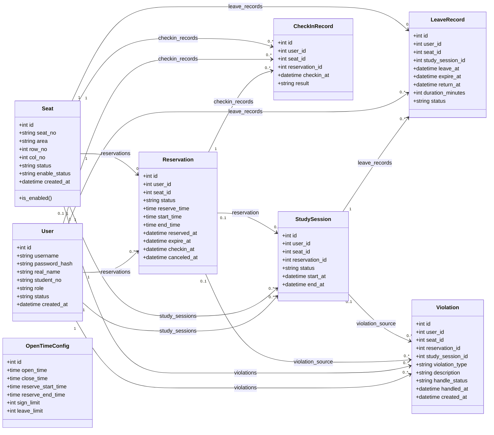

# 实际项目类图

本文档根据当前代码结构生成，和项目实际文件、函数、模型字段保持一致。

## 分层类图

```mermaid
classDiagram
direction TB

namespace 表现层_React页面 {
  class App {
    +handleLogin(loginData)
    +handleLogout()
    +handleReservationChanged()
  }
  class LoginPage {
    +handleSubmit(values)
  }
  class RegisterPage {
    +handleSubmit(values)
  }
  class SeatMapPage {
    +loadSeats()
    +openReserveModal(seat)
    +closeReserveModal()
    +handleReserve()
  }
  class MyReservationPage {
    +loadReservation()
    +handleCheckIn()
  }
  class CurrentSeatPage {
    +loadSession()
    +runAction(action, successText)
    +releaseSeat()
  }
  class StudyReportPage {
    +loadReport()
  }
  class AdminDashboardPage {
    +loadStatistics()
  }
  class AdminSeatPage {
    +loadSeats()
    +openCreateModal()
    +openEditModal(seat)
    +handleSubmit()
    +handleDelete(seat)
    +handleEnable(seat)
    +handleDisable(seat)
  }
  class AdminUserPage {
    +loadUsers()
    +updateUserStatus(user, action)
  }
  class AdminViolationPage {
    +loadViolations()
    +handleViolation(violation)
  }
  class AdminOpenTimePage {
    +loadConfig()
    +handleSave()
    +handleCheckTimeouts()
  }
}

namespace 控制层_FlaskController {
  class AuthController {
    +register()
    +login()
  }
  class SeatController {
    +list_seats()
  }
  class ReservationController {
    +reserve_seat()
    +my_reservation()
    +checkin(reservation_id)
  }
  class StudySessionController {
    +current_session()
    +leave(study_session_id)
    +return_seat(study_session_id)
    +release(study_session_id)
  }
  class ReportController {
    +my_report()
  }
  class AdminSeatController {
    +list_admin_seats()
    +create_seat()
    +update_seat(seat_id)
    +delete_seat(seat_id)
    +enable_seat(seat_id)
    +disable_seat(seat_id)
  }
  class AdminController {
    +statistics()
    +violations()
    +handle_violation_record(violation_id)
    +users()
    +ban(user_id)
    +unban(user_id)
  }
  class AdminOpenTimeController {
    +get_config()
    +update_config()
  }
  class AdminTimeoutController {
    +check_system_timeouts()
  }
  class HealthController {
    +health_check()
  }
}

namespace 业务层_Service {
  class AuthService {
    +register_user(data)
    +login_user(data)
  }
  class SeatService {
    +get_seat_list()
  }
  class ReservationService {
    +create_reservation(user, data)
    +get_my_active_reservation(user)
    +checkin_reservation(user, reservation_id)
  }
  class StudySessionService {
    +get_my_current_session(user)
    +leave_study_session(user, study_session_id)
    +return_study_session(user, study_session_id)
    +release_study_session(user, study_session_id)
    +check_timeouts()
  }
  class ReportService {
    +get_my_report(user)
  }
  class AdminSeatService {
    +get_admin_seats()
    +create_admin_seat(data)
    +update_admin_seat(seat_id, data)
    +delete_admin_seat(seat_id)
    +enable_admin_seat(seat_id)
    +disable_admin_seat(seat_id)
  }
  class AdminService {
    +get_admin_statistics()
    +get_admin_users()
    +ban_user(user_id)
    +unban_user(user_id)
    +get_admin_violations()
    +handle_violation(violation_id)
  }
  class OpenTimeConfigService {
    +parse_hhmm(value, field_name)
    +format_hhmm(value)
    +get_open_time_config()
    +update_open_time_config(data)
  }
}

namespace 数据访问层_DAO {
  class UserDAO {
    +find_user_by_id(user_id)
    +find_user_by_username(username)
    +find_user_by_student_no(student_no)
    +save_user(user)
  }
  class SeatDAO {
    +find_seat_by_id(seat_id)
    +find_seat_by_no(seat_no)
    +get_all_seat_models()
    +save_seat(seat)
    +delete_seat(seat)
    +find_all_seats()
  }
  class ReservationDAO {
    +find_reservation_by_id(reservation_id)
    +find_active_reservation_by_user(user_id)
    +find_active_reservation_by_seat(seat_id)
    +find_conflicting_reservation(seat_id, start_time, end_time)
    +save_reservation(reservation)
  }
  class StudySessionDAO {
    +find_study_session_by_id(study_session_id)
    +find_active_session_by_user(user_id)
    +find_current_session_by_user(user_id)
    +find_active_session_by_seat(seat_id)
    +save_study_session(study_session)
  }
  class LeaveRecordDAO {
    +find_active_leave_by_session(study_session_id)
  }
  class ReportDAO {
    +find_finished_sessions_by_user(user_id)
    +count_violations_by_user(user_id)
  }
  class OpenTimeConfigDAO {
    +find_open_time_config()
  }
  class AdminDAO {
    +get_all_users()
    +get_user_by_id(user_id)
    +get_all_violations()
    +get_violation_by_id(violation_id)
    +count_seats()
    +count_seats_by_status(status)
    +count_reservations_since(start_time)
    +get_finished_sessions_since(start_time)
    +count_violations()
  }
}

App --> LoginPage
App --> RegisterPage
App --> SeatMapPage
App --> MyReservationPage
App --> CurrentSeatPage
App --> StudyReportPage
App --> AdminDashboardPage
App --> AdminSeatPage
App --> AdminUserPage
App --> AdminViolationPage
App --> AdminOpenTimePage

LoginPage --> AuthController
RegisterPage --> AuthController
SeatMapPage --> SeatController
SeatMapPage --> ReservationController
MyReservationPage --> ReservationController
CurrentSeatPage --> StudySessionController
StudyReportPage --> ReportController
AdminDashboardPage --> AdminController
AdminSeatPage --> AdminSeatController
AdminUserPage --> AdminController
AdminViolationPage --> AdminController
AdminOpenTimePage --> AdminOpenTimeController
AdminOpenTimePage --> AdminTimeoutController

AuthController --> AuthService
SeatController --> SeatService
ReservationController --> ReservationService
StudySessionController --> StudySessionService
ReportController --> ReportService
AdminSeatController --> AdminSeatService
AdminController --> AdminService
AdminOpenTimeController --> OpenTimeConfigService
AdminTimeoutController --> StudySessionService

AuthService --> UserDAO
SeatService --> SeatDAO
ReservationService --> ReservationDAO
ReservationService --> SeatDAO
ReservationService --> StudySessionDAO
ReservationService --> OpenTimeConfigDAO
StudySessionService --> StudySessionDAO
StudySessionService --> LeaveRecordDAO
StudySessionService --> OpenTimeConfigDAO
ReportService --> ReportDAO
AdminSeatService --> SeatDAO
AdminSeatService --> ReservationDAO
AdminSeatService --> StudySessionDAO
AdminService --> AdminDAO
OpenTimeConfigService --> OpenTimeConfigDAO
```

## 实体类图

```mermaid
classDiagram
direction LR

class User {
  +int id
  +string username
  +string password_hash
  +string real_name
  +string student_no
  +string role
  +string status
  +datetime created_at
}

class Seat {
  +int id
  +string seat_no
  +string area
  +int row_no
  +int col_no
  +string status
  +string enable_status
  +datetime created_at
  +is_enabled()
}

class Reservation {
  +int id
  +int user_id
  +int seat_id
  +string status
  +time reserve_time
  +time start_time
  +time end_time
  +datetime reserved_at
  +datetime expire_at
  +datetime checkin_at
  +datetime canceled_at
}

class StudySession {
  +int id
  +int user_id
  +int seat_id
  +int reservation_id
  +string status
  +datetime start_at
  +datetime end_at
}

class CheckInRecord {
  +int id
  +int user_id
  +int seat_id
  +int reservation_id
  +datetime checkin_at
  +string result
}

class LeaveRecord {
  +int id
  +int user_id
  +int seat_id
  +int study_session_id
  +datetime leave_at
  +datetime expire_at
  +datetime return_at
  +int duration_minutes
  +string status
}

class Violation {
  +int id
  +int user_id
  +int seat_id
  +int reservation_id
  +int study_session_id
  +string violation_type
  +string description
  +string handle_status
  +datetime handled_at
  +datetime created_at
}

class OpenTimeConfig {
  +int id
  +time open_time
  +time close_time
  +time reserve_start_time
  +time reserve_end_time
  +int sign_limit
  +int leave_limit
}

User "1" --> "0..*" Reservation : reservations
Seat "1" --> "0..*" Reservation : reservations
User "1" --> "0..*" StudySession : study_sessions
Seat "1" --> "0..*" StudySession : study_sessions
Reservation "0..1" --> "0..*" StudySession : reservation
Reservation "1" --> "0..*" CheckInRecord : checkin_records
User "1" --> "0..*" CheckInRecord : checkin_records
Seat "1" --> "0..*" CheckInRecord : checkin_records
StudySession "1" --> "0..*" LeaveRecord : leave_records
User "1" --> "0..*" LeaveRecord : leave_records
Seat "1" --> "0..*" LeaveRecord : leave_records
User "1" --> "0..*" Violation : violations
Seat "0..1" --> "0..*" Violation : violations
Reservation "0..1" --> "0..*" Violation : violation_source
StudySession "0..1" --> "0..*" Violation : violation_source
```

## 主要接口和页面对应关系

```mermaid
flowchart TB
  LoginPage["登录页"] --> AuthAPI["POST /api/auth/login"]
  RegisterPage["注册页"] --> RegisterAPI["POST /api/auth/register"]
  SeatMapPage["座位地图"] --> SeatAPI["GET /api/seats"]
  SeatMapPage --> ReserveAPI["POST /api/reservations"]
  MyReservationPage["我的预约"] --> MyReservationAPI["GET /api/reservations/me"]
  MyReservationPage --> CheckinAPI["POST /api/reservations/{id}/checkin"]
  CurrentSeatPage["当前座位"] --> CurrentAPI["GET /api/study-sessions/me"]
  CurrentSeatPage --> LeaveAPI["POST /api/study-sessions/{id}/leave"]
  CurrentSeatPage --> ReturnAPI["POST /api/study-sessions/{id}/return"]
  CurrentSeatPage --> ReleaseAPI["POST /api/study-sessions/{id}/release"]
  StudyReportPage["学习报告"] --> ReportAPI["GET /api/reports/me"]
  AdminDashboardPage["管理统计"] --> StatisticsAPI["GET /api/admin/statistics"]
  AdminSeatPage["座位管理"] --> AdminSeatAPI["GET/POST/PUT/DELETE/PATCH /api/admin/seats"]
  AdminUserPage["用户管理"] --> AdminUserAPI["GET/PATCH /api/admin/users"]
  AdminViolationPage["违约管理"] --> AdminViolationAPI["GET/PATCH /api/admin/violations"]
  AdminOpenTimePage["开放时间"] --> OpenTimeAPI["GET/PUT /api/admin/open-time-config"]
  AdminOpenTimePage --> TimeoutAPI["POST /api/admin/check-timeouts"]
```
