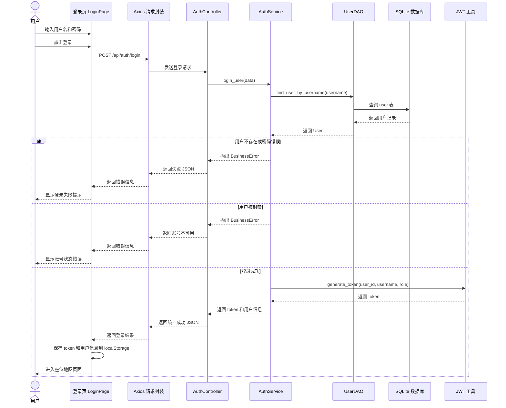
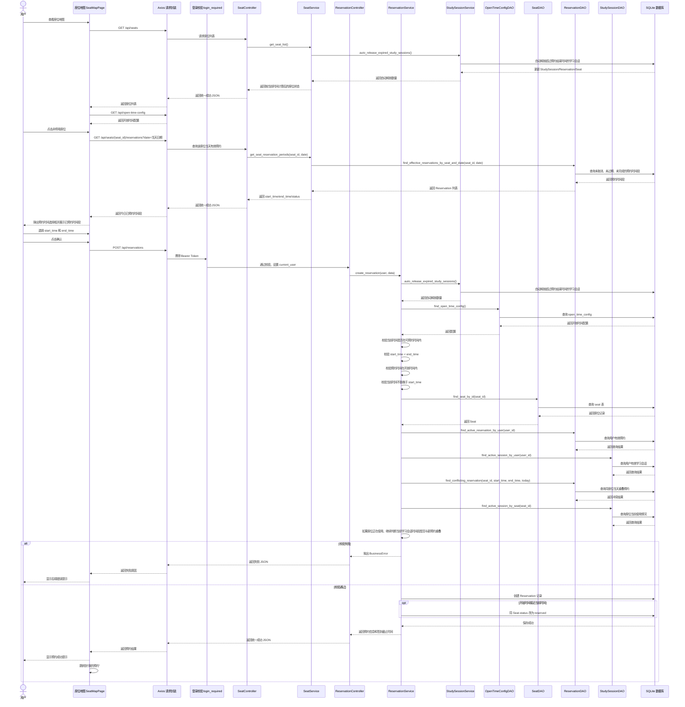
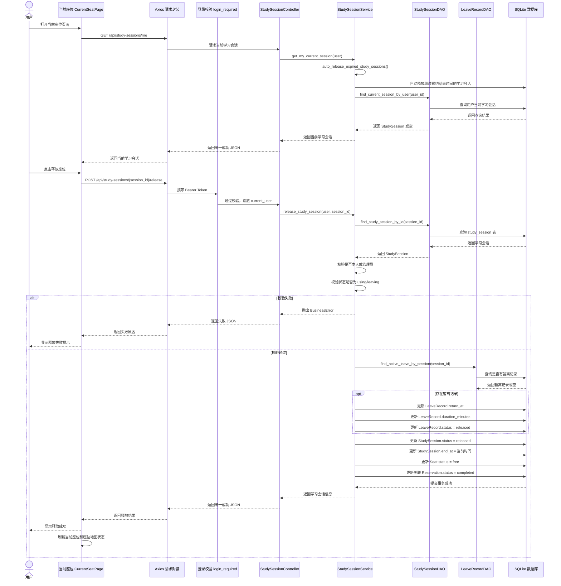

# 核心业务顺序图

## 1. 登录系统顺序图

```mermaid
sequenceDiagram
    actor User as 用户
    participant LoginPage as 登录页 LoginPage
    participant Axios as Axios 请求封装
    participant AuthController as AuthController
    participant AuthService as AuthService
    participant UserDAO as UserDAO
    participant DB as SQLite 数据库
    participant JWT as JWT 工具

    User->>LoginPage: 输入用户名和密码
    User->>LoginPage: 点击登录
    LoginPage->>Axios: POST /api/auth/login
    Axios->>AuthController: 发送登录请求
    AuthController->>AuthService: login_user(data)
    AuthService->>UserDAO: find_user_by_username(username)
    UserDAO->>DB: 查询 user 表
    DB-->>UserDAO: 返回用户记录
    UserDAO-->>AuthService: 返回 User

    alt 用户不存在或密码错误
        AuthService-->>AuthController: 抛出 BusinessError
        AuthController-->>Axios: 返回失败 JSON
        Axios-->>LoginPage: 返回错误信息
        LoginPage-->>User: 显示登录失败提示
    else 用户被封禁
        AuthService-->>AuthController: 抛出 BusinessError
        AuthController-->>Axios: 返回账号不可用
        Axios-->>LoginPage: 返回错误信息
        LoginPage-->>User: 显示账号状态错误
    else 登录成功
        AuthService->>JWT: generate_token(user_id, username, role)
        JWT-->>AuthService: 返回 token
        AuthService-->>AuthController: 返回 token 和用户信息
        AuthController-->>Axios: 返回统一成功 JSON
        Axios-->>LoginPage: 返回登录结果
        LoginPage->>LoginPage: 保存 token 和用户信息到 localStorage
        LoginPage-->>User: 进入座位地图页面
    end
```

## 2. 预约座位顺序图

```mermaid
sequenceDiagram
    actor User as 用户
    participant SeatMapPage as 座位地图 SeatMapPage
    participant Axios as Axios 请求封装
    participant Auth as 登录校验 login_required
    participant SeatController as SeatController
    participant SeatService as SeatService
    participant ReservationController as ReservationController
    participant ReservationService as ReservationService
    participant StudySessionService as StudySessionService
    participant OpenTimeDAO as OpenTimeConfigDAO
    participant SeatDAO as SeatDAO
    participant ReservationDAO as ReservationDAO
    participant StudySessionDAO as StudySessionDAO
    participant DB as SQLite 数据库

    User->>SeatMapPage: 查看座位地图
    SeatMapPage->>Axios: GET /api/seats
    Axios->>SeatController: 请求座位列表
    SeatController->>SeatService: get_seat_list()
    SeatService->>StudySessionService: auto_release_expired_study_sessions()
    StudySessionService->>DB: 自动释放超过预约结束时间的学习会话
    DB-->>StudySessionService: 更新 StudySession/Reservation/Seat
    StudySessionService-->>SeatService: 返回自动释放数量
    SeatService-->>SeatController: 返回按当前时间计算后的座位状态
    SeatController-->>Axios: 返回统一成功 JSON
    Axios-->>SeatMapPage: 返回座位列表
    SeatMapPage->>Axios: GET /api/open-time-config
    Axios-->>SeatMapPage: 返回开放时间配置
    User->>SeatMapPage: 点击非停用座位
    SeatMapPage->>Axios: GET /api/seats/{seat_id}/reservations?date=当天日期
    Axios->>SeatController: 查询该座位当天有效预约
    SeatController->>SeatService: get_seat_reservation_periods(seat_id, date)
    SeatService->>ReservationDAO: find_effective_reservations_by_seat_and_date(seat_id, date)
    ReservationDAO->>DB: 查询未取消、未过期、未完成的预约时间段
    DB-->>ReservationDAO: 返回预约时间段
    ReservationDAO-->>SeatService: 返回 Reservation 列表
    SeatService-->>SeatController: 返回 start_time/end_time/status
    SeatController-->>Axios: 返回统一成功 JSON
    Axios-->>SeatMapPage: 返回今日已预约时间段
    SeatMapPage-->>User: 弹出预约时间选择框并展示已预约时间段
    User->>SeatMapPage: 选择 start_time 和 end_time
    User->>SeatMapPage: 点击确认
    SeatMapPage->>Axios: POST /api/reservations
    Axios->>Auth: 携带 Bearer Token
    Auth->>ReservationController: 通过校验，设置 current_user
    ReservationController->>ReservationService: create_reservation(user, data)
    ReservationService->>StudySessionService: auto_release_expired_study_sessions()
    StudySessionService->>DB: 自动释放超过预约结束时间的学习会话
    StudySessionService-->>ReservationService: 返回自动释放数量

    ReservationService->>OpenTimeDAO: find_open_time_config()
    OpenTimeDAO->>DB: 查询 open_time_config
    DB-->>OpenTimeDAO: 返回开放时间配置
    OpenTimeDAO-->>ReservationService: 返回配置

    ReservationService->>ReservationService: 校验当前时间是否在可预约时间内
    ReservationService->>ReservationService: 校验 start_time < end_time
    ReservationService->>ReservationService: 校验预约时间在开放时间内
    ReservationService->>ReservationService: 校验当前时间不能晚于 start_time

    ReservationService->>SeatDAO: find_seat_by_id(seat_id)
    SeatDAO->>DB: 查询 seat 表
    DB-->>SeatDAO: 返回座位记录
    SeatDAO-->>ReservationService: 返回 Seat

    ReservationService->>ReservationDAO: find_active_reservation_by_user(user_id)
    ReservationDAO->>DB: 查询用户有效预约
    DB-->>ReservationDAO: 返回查询结果

    ReservationService->>StudySessionDAO: find_active_session_by_user(user_id)
    StudySessionDAO->>DB: 查询用户有效学习会话
    DB-->>StudySessionDAO: 返回查询结果

    ReservationService->>ReservationDAO: find_conflicting_reservation(seat_id, start_time, end_time, today)
    ReservationDAO->>DB: 查询同座位当天重叠预约
    DB-->>ReservationDAO: 返回冲突结果

    ReservationService->>StudySessionDAO: find_active_session_by_seat(seat_id)
    StudySessionDAO->>DB: 查询座位当前使用情况
    DB-->>StudySessionDAO: 返回查询结果
    ReservationService->>ReservationService: 如果座位正在使用，继续判断当前学习会话时间段是否与新预约重叠

    alt 校验失败
        ReservationService-->>ReservationController: 抛出 BusinessError
        ReservationController-->>Axios: 返回失败 JSON
        Axios-->>SeatMapPage: 返回失败原因
        SeatMapPage-->>User: 显示后端错误提示
    else 校验通过
        ReservationService->>DB: 创建 Reservation 记录
        opt 开始时间接近当前时间
            ReservationService->>DB: 将 Seat.status 改为 reserved
        end
        DB-->>ReservationService: 保存成功
        ReservationService-->>ReservationController: 返回预约信息和签到截止时间
        ReservationController-->>Axios: 返回统一成功 JSON
        Axios-->>SeatMapPage: 返回预约结果
        SeatMapPage-->>User: 显示预约成功提示
        SeatMapPage->>SeatMapPage: 跳转到“我的预约”
    end
```

## 3. 释放座位顺序图

```mermaid
sequenceDiagram
    actor User as 用户
    participant CurrentSeatPage as 当前座位 CurrentSeatPage
    participant Axios as Axios 请求封装
    participant Auth as 登录校验 login_required
    participant StudySessionController as StudySessionController
    participant StudySessionService as StudySessionService
    participant StudySessionDAO as StudySessionDAO
    participant LeaveRecordDAO as LeaveRecordDAO
    participant DB as SQLite 数据库

    User->>CurrentSeatPage: 打开当前座位页面
    CurrentSeatPage->>Axios: GET /api/study-sessions/me
    Axios->>StudySessionController: 请求当前学习会话
    StudySessionController->>StudySessionService: get_my_current_session(user)
    StudySessionService->>StudySessionService: auto_release_expired_study_sessions()
    StudySessionService->>DB: 自动释放超过预约结束时间的学习会话
    StudySessionService->>StudySessionDAO: find_current_session_by_user(user_id)
    StudySessionDAO->>DB: 查询用户当前学习会话
    DB-->>StudySessionDAO: 返回查询结果
    StudySessionDAO-->>StudySessionService: 返回 StudySession 或空
    StudySessionService-->>StudySessionController: 返回当前学习会话
    StudySessionController-->>Axios: 返回统一成功 JSON
    Axios-->>CurrentSeatPage: 返回当前学习会话
    User->>CurrentSeatPage: 点击释放座位
    CurrentSeatPage->>Axios: POST /api/study-sessions/{session_id}/release
    Axios->>Auth: 携带 Bearer Token
    Auth->>StudySessionController: 通过校验，设置 current_user
    StudySessionController->>StudySessionService: release_study_session(user, session_id)

    StudySessionService->>StudySessionDAO: find_study_session_by_id(session_id)
    StudySessionDAO->>DB: 查询 study_session 表
    DB-->>StudySessionDAO: 返回学习会话
    StudySessionDAO-->>StudySessionService: 返回 StudySession

    StudySessionService->>StudySessionService: 校验是否本人或管理员
    StudySessionService->>StudySessionService: 校验状态是否为 using/leaving

    alt 校验失败
        StudySessionService-->>StudySessionController: 抛出 BusinessError
        StudySessionController-->>Axios: 返回失败 JSON
        Axios-->>CurrentSeatPage: 返回失败原因
        CurrentSeatPage-->>User: 显示释放失败提示
    else 校验通过
        StudySessionService->>LeaveRecordDAO: find_active_leave_by_session(session_id)
        LeaveRecordDAO->>DB: 查询是否有暂离记录
        DB-->>LeaveRecordDAO: 返回暂离记录或空

        opt 存在暂离记录
            StudySessionService->>DB: 更新 LeaveRecord.return_at
            StudySessionService->>DB: 更新 LeaveRecord.duration_minutes
            StudySessionService->>DB: 更新 LeaveRecord.status = released
        end

        StudySessionService->>DB: 更新 StudySession.status = released
        StudySessionService->>DB: 更新 StudySession.end_at = 当前时间
        StudySessionService->>DB: 更新 Seat.status = free
        StudySessionService->>DB: 更新关联 Reservation.status = completed
        DB-->>StudySessionService: 提交事务成功

        StudySessionService-->>StudySessionController: 返回学习会话信息
        StudySessionController-->>Axios: 返回统一成功 JSON
        Axios-->>CurrentSeatPage: 返回释放结果
        CurrentSeatPage-->>User: 显示释放成功
        CurrentSeatPage->>CurrentSeatPage: 刷新当前座位和座位地图状态
    end
```
